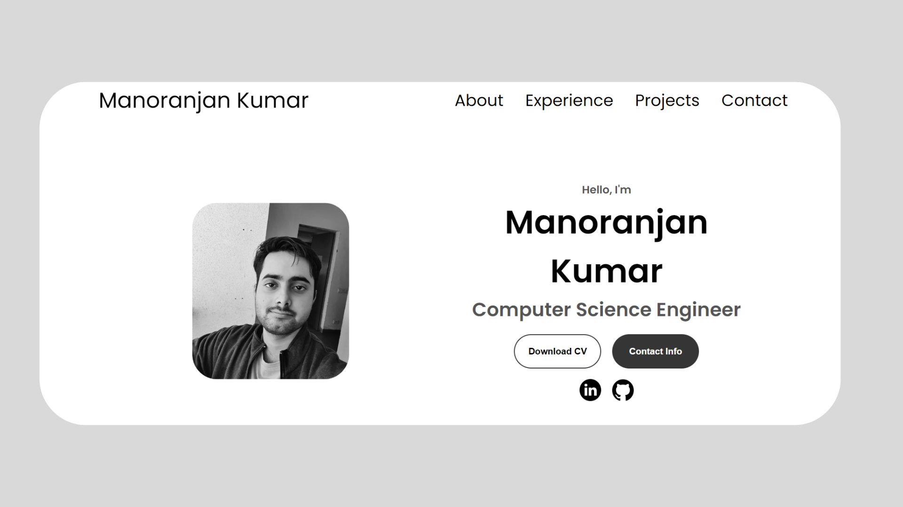

  

# My Portfolio Website

Welcome to my personal portfolio website, showcasing my skills, experience, and projects. This website is built using **HTML**, **CSS**, and **JavaScript**. It is designed to be responsive across different devices using **media queries**.

## Features

- **Responsive Navigation:** The website has a desktop navigation bar and a hamburger menu for mobile devices.
- **About Section:** A detailed overview of my certifications, education, and an introduction to myself.
- **Experience Section:** Displays my technical skills and certifications, including:
  - HTML, CSS, JavaScript, DBMS, C++, and soft skills.
  - ServiceNow certifications (CSA and CAD).
- **Projects Section:** Showcases my major projects with links to GitHub repositories:
  - DBMS Notes
  - Vehicle Parking System
- **Contact Section:** Provides direct links to my email and LinkedIn profile for easy communication.

## Project Structure

- **index.html:** The main HTML file that defines the structure of the portfolio.
- **style.css:** Contains the core styles for the website, ensuring a modern and clean look.
- **mediaqueries.css:** Manages the website’s responsiveness and layout on different screen sizes.
- **script.js:** Handles the interactivity of the hamburger menu for mobile navigation.
- **assets/:** This folder contains all the images and icons used in the project (profile picture, social media icons, project screenshots, etc.).

## Technologies Used

- **HTML5**: For structuring the web pages.
- **CSS3**: For styling and designing the website.
- **JavaScript**: For implementing interactivity, such as navigation toggling.
- **ServiceNow**: For certifications showcased in the portfolio.

## How to View

To view the website:

1. Live-link:
  
   https://manoranjan75.github.io/portfolio-vista/
